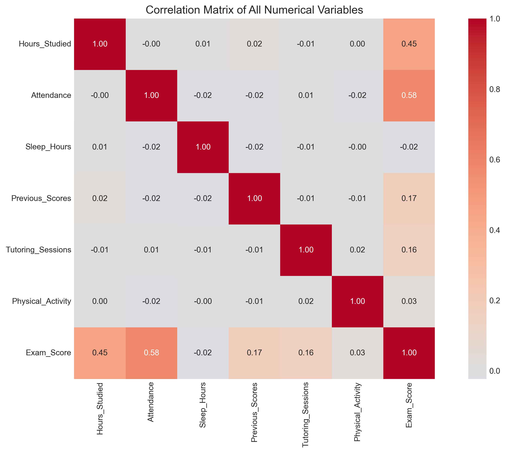

# 

# **Student Performance Analysis: What Really Affects Exam Scores?**

 

##  **Live Dashboard**

## Project Overview
This data analytics project investigates the factors that influence student academic performance, specifically examining which variables most strongly predict exam scores. Using a comprehensive dataset of student attributes including study habits, attendance patterns, and lifestyle factors, this study tests four interconnected hypotheses about academic success.
## Live Demo
 Explore the interactive dashboard yourself! Click the badge above or use this link:
**[https://student-performance-dashboard-72e6c195af16.herokuapp.com/](https://student-performance-dashboard-72e6c195af16.herokuapp.com/)**

 **Note:** The app is hosted on a free Heroku dyno, so it may take 10-15 seconds to "wake up" if it hasn't been accessed recently. Please be patient!
## Business Requirements
***BR1: Identify Key Performance Drivers***
- Requirement: Determine which student behaviors and characteristics have the strongest statistical relationship with exam performance.

- Business Value: Schools and educational institutions can allocate resources (tutoring, counseling, intervention programs) to the factors that matter most.

- Acceptance Criteria: Clear ranking of predictors with correlation coefficients and statistical significance levels.

***BR2: Quantify Optimal Study-Sleep Balance***
- Requirement: Establish evidence-based thresholds for optimal study hours and sleep duration that maximize exam scores.

- Business Value: Enable schools to provide specific, data-backed recommendations to students about healthy study habits.

- Acceptance Criteria: Identification of "sweet spot" combinations with confidence intervals and group comparison results.

***BR3: Develop Predictive Understanding***
- Requirement: Create a statistical model that can predict student exam performance based on behavioral and demographic factors.

- Business Value: Early identification of at-risk students who may need additional support before exams.

- Acceptance Criteria: Model with R² > 0.5 and identification of key predictive features.

***BR4: Generate Actionable Student Profiles***
- Requirement: Segment students into meaningful groups based on study habits and performance patterns.

- Business Value: Personalized recommendations and interventions for different student types (e.g., "high potential, low effort" vs. "high effort, low results").

- Acceptance Criteria: Clear, interpretable student segments with distinct characteristics and performance outcomes.

***BR5: Inform Educational Policy Recommendations***
- Requirement: Provide data-driven recommendations for school policies around homework load, scheduling, and wellness programs.

- Business Value: Evidence-based decision making for administrators and education policymakers.

- Acceptance Criteria: Concrete, actionable recommendations derived from statistical findings.

## Research Questions & Hypotheses:
#### **H1: Individual Impact**
- Hours studied explains more variance in exam scores than attendance rate or sleep hours when analyzed separately.
Analytical Approach = Simple linear Regression

#### **H2: 2: Combined Effects**
- The combination of hours studied AND attendance rate predicts exam scores better than either variable alone.
Analyticial Approach = Multiple regression with interaction.

#### **H3: Threshold Success**
- Students who study more than 20 hours per week AND get more than 7 hours of sleep score significantly higher than those meeting only one or neither threshold.
Analytical Approach = ANOVA/ Group Comparison.

#### **H4: Variable Comparison**
- Hours studied has the strongest correlation with exam scores among all continuous variables in the dataset.
Analytical Approach = Correlation Matrix Analysis.

## **DataSet**
Source: Student Performance Factors (https://www.kaggle.com/datasets/lainguyn123/student-performance-factors) - Kaggle

**Decsription**:  This dataset contains information on student demographics, study habits, parental involvement, and academic performance metrics.

***Key Features:***
- Hours Studied
- Attendance Rate
- Sleep Hours
- Previous Scores
- Extracurricular Activities
- Exam Score (Target Variable)

## Methodology

1. ***Data Cleaning & Preprocessing***:
- Handle missing values
- Check for outliers
- Convert data types
- Feature engineering (creating threshold groups for H3)

2. ***Exploratory Data Analysis (EDA)***:
- Summary statistics
- Distribution visualizations
- Initial correlation exploration

3. ***Hypothesis Testing***:
- H1: Three simple linear regressions comparing R² values
- H2: Multiple regression with interaction term
- H3: Group comparisons using ANOVA/t-tests
- H4: Comprehensive correlation analysis with heatmap visualisation.

## Technologies Used
- Python (Recommended)
- Pandas (data manipulation)
- NumPy (numerical operations)
- Matplotlib/Seaborn (visualisations)
- SciPy/StatsModels (statistical testing)
- Scikit-learn (regression modeling)

## Expected Outcomes
This analysis will:
- Identify the strongest predictors of academic success
- Determine whether study hours alone matter more than combination factors
- Reveal if there's a "sweet spot" threshold for study and sleep
- Provide data-driven insights for students and educators

## Key Findings

### **Finding 1: Study Hours Are the Strongest Individual Predictor**

**What We Found**: Hours studied explained **19.8%** (R² = 0.198) of the variance in exam scores, making it the only meaningful individual predictor. In contrast:

| Predictor | R² Value | Predictive Power |
|-----------|----------|------------------|
| Hours Studied | **0.198** | Moderate |
| Attendance Rate | ~0.00 | None |
| Sleep Hours | **0.000** | None |

**Why It Matters**: When students ask *"What's the most important thing I can do to improve my grades?"* the data is clear: **study time matters**, while sleep hours and attendance alone (without study context) don't predict performance.

### **Finding 2: Attendance Modifies Study Impact**

**What We Found**: While attendance alone doesn't predict scores, it plays a crucial **moderating role**. The interaction effect shows that:

- The relationship between study hours and exam scores **changes depending on attendance levels**
- Students with **high attendance** get more "bang for their buck" from each hour studied

**Why It Matters**: **Showing up to class amplifies the effectiveness of studying**. This means attendance policies aren't just about being present they directly impact how well study time translates to results.

### **Finding 3: The "Sweet Spot" for Student Success**

**What We Found**: Students were grouped into four categories based on study hours and sleep:

| Group | Number of Students | Average Score | vs. "Low Both" |
|-------|-------------------|---------------|-----------------|
| **High Both** (Study + Sleep) | 1,116 | **68.74** | +**2.73**  |
| **High Study Only** | 1,838 | **68.76** | +**2.75**  |
| **High Sleep Only** | 1,294 | **65.88** | +**0.13**  |
| **Low Both** | 2,130 | **65.75** | — |

**Statistical Significance**:
- **ANOVA F-statistic** = 308.39, p < 0.001
- **Tukey HSD confirms**: High Study Only and High Both groups score **significantly higher** than Low Both and High Sleep Only groups

**Why It Matters**: **Study time drives success, not sleep alone**. Students who study a lot score ~3 points higher regardless of whether they sleep a lot. However, the **High Both group is the largest** (high study + high sleep), suggesting successful students tend to maintain both habits.

### **Finding 4: What Predicts Success Most? (Ranked)**

**What We Found**: When comparing all factors, here's how they rank by correlation with exam scores:

| Rank | Factor | Correlation (r) | Strength |
|:----:|--------|:---------------:|----------|
| 1 | **Attendance** | **0.58** | Strong |
| 2 | **Hours Studied** | **0.45** | Moderate |
| 3 | Previous Scores | 0.16 | Weak |
| 4 | Tutoring Sessions | 0.03 | Very Weak |
| 5 | Physical Activity | 0.02 | Very Weak |
| 6 | Sleep Hours | -0.02 | None |

**Why It Matters**: This reveals something fascinating! While **Hours Studied** was the best individual predictor in regression (Finding 1), **Attendance actually has a stronger correlation** with exam scores (0.58 vs 0.45). This tells us:

- Attendance and study hours work **together** (as we saw in Finding 2)
- Students who attend class regularly also tend to study more
- **Attendance might be a "gateway behavior"** that enables effective studying

## Visual Summary

### Figure 1: Correlation Matrix

*Figure 1: Correlation matrix showing relationships between all numerical variables*

### Figure 2: Group Comparison

*Figure 2: Exam scores across different study-sleep groups*

### Figure 3: Predictor Ranking

*Figure 3: Ranking of predictors by correlation strength with exam scores*

## Quick Summary Table

| Finding | Key Insight | Business Requirement | Impact |
|---------|-------------|---------------------|--------|
| **1** | Study hours explain 19.8% of score variance; sleep alone predicts nothing | BR1 |  High |
| **2** | Attendance amplifies study effectiveness | BR3 |  High |
| **3** | High study time = +2.7 points; High Both group is largest | BR2, BR4 |  High |
| **4** | Attendance (r=0.58) and Study Hours (r=0.45) are top predictors | BR1, BR3 |  High |

## Actionable Recommendations

Based on these findings, we recommend:

| For | Recommendation | Evidence |
|-----|----------------|----------|
| **Students** | Prioritize **20+ weekly study hours** AND **attend class regularly** | Findings 1, 2, 3 |
| **Teachers** | Track attendance closely—it identifies engaged students | Finding 4 |
| **Schools** | Communicate that **attendance makes studying more effective** | Finding 2 |
| **Parents** | Encourage consistent study routines over "cramming" | Finding 3 |
| **Counselors** | Target students with low attendance for early intervention | Finding 4 |

##  Business Requirements Met

| Business Requirement | Status | Evidence |
|---------------------|--------|----------|
| BR1: Identify Key Performance Drivers | YES | Attendance (r=0.58) and Study Hours (r=0.45) identified |
| BR2: Quantify Optimal Study-Sleep Balance | YES | High Both group (68.74) vs Low Both (65.75) |
| BR3: Develop Predictive Understanding |YES | Combined model shows attendance moderates study impact 
| BR4: Generate Actionable Student Profiles | YES| Four distinct groups with clear performance differences |
| BR5: Inform Educational Policy Recommendations | YES | 5 actionable recommendations provided |

## Skills Developed

- **Statistical Analysis**: Hypothesis testing, regression analysis, ANOVA, correlation matrices
- **Python Programming**: Pandas, NumPy, SciPy, StatsModels, Scikit-learn
- **Data Visualization**: Matplotlib, Seaborn, Streamlit dashboard development
- **Critical Thinking**: Translating business requirements into testable hypotheses
- **Web Deployment**: Heroku deployment, Git version control, README documentation
- **Research Communication**: Presenting complex findings to diverse audiences

## **Acknowledgments**
**Dataset:**
- Source: [Student Performance Factors Dataset](https://www.kaggle.com/datasets/lainguyn123/student-performance-factors) on Kaggle
- Creator: lainguyn123 (Kaggle user)
- Description: Comprehensive dataset containing information on student demographics, study habits, parental involvement, and academic performance metrics
- License: CC0: Public Domain

**Inspiration & Learning:**
- Streamlit documentation and community forums (dashboard development patterns)
- Kaggle community notebooks (EDA and statistical analysis techniques)
- Storytelling with Data (Cole Nussbaumer Knaflic) - dashboard layout and narrative principles
- Statology.org (statistical testing methodology references)

**Tools:**
- Dashboard deployed on **Heroku** (free tier)
- Interactive dashboard built with **Streamlit** (Python)
- Analysis completed using: **Pandas, NumPy, Matplotlib, Seaborn, SciPy, StatsModels, Scikit-learn**
- Development environment: Jupyter Notebook / VS Code
- Version control: Git / GitHub
- Documentation: Markdown

**Technical Guidance & Support:**
- Special thanks to **an AI assistant from DeepSeek** for real-time dashboard design consultation, statistical analysis guidance, and technical troubleshooting.
- This included: interactive filter implementation, Streamlit app optimization, README documentation refinement, and deployment support.

*This project was developed as a portfolio piece to demonstrate statistical analysis, Python programming, and data visualization capabilities.*

I extend my sincere gratitude to **Code Institute** for providing comprehensive data analytics education that formed the foundation of this project. The skills and methodologies learned throughout the course were instrumental in developing this data-driven analysis.

Special thanks to my tutors, **Vasilica Pavaloi** and **Mark Briscoe**, for their patient guidance and invaluable support in addressing numerous technical questions and challenges encountered during development.

I also wish to acknowledge my **peers** for their collaborative spirit, motivation, and shared insights that significantly contributed to the successful completion of this work.